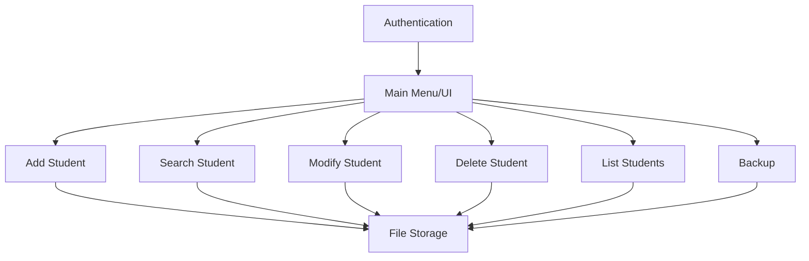

# High-Level Design (HLD)

## Project Overview
The Student Management System is a modular, extensible C application for managing student records. It features a robust, validated data model, a user-friendly text-based interface, and clear separation of concerns across modules. The system supports adding, searching, modifying, deleting, listing, and backing up student data, and is designed for maintainability and future enhancements.

## Key Features
- Modular codebase with clear separation of concerns
- Robust input validation and user feedback
- CRUD operations for student records
- Backup functionality
- Extensible for advanced features (search by name, CSV export, reporting, etc.)
- Portable, text-based interface

## Main Modules
- **Authentication Module**: Handles user login and password verification.
- **Student Record Management**:
  - Add Student
  - Search Student (by roll number)
  - Modify Student
  - Delete Student
  - List All Students
- **Backup Module**: Backs up the student database.
- **UI Module**: Handles menu and user prompts.
- **File Operations Module**: Manages file I/O for student data and backups.

## Data Storage
- Student records are stored in a binary file (`data/DATABASE.DAT`).
- Backups are stored in `data/BACKUP.DAT`.

## User Interface
- Text-based menu system for portability and clarity
- Clear prompts, error messages, and confirmations

## Extensibility
- Easily add new features (e.g., search by name, export, reporting)
- Modular structure allows for future UI or database upgrades

## High-Level Architecture Diagram

---

*For more details, see the Low-Level Design (LLD) document.* 